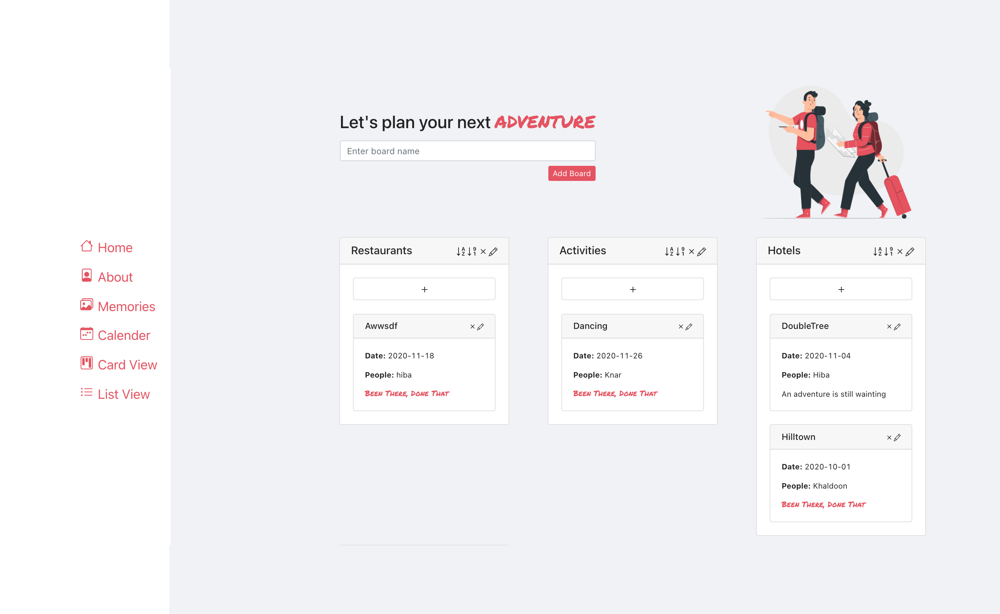

# Travel Board Project

Website Link: (https://board-project-81479.web.app)

This project is a web-based Kanban-style for travel list-making. It was
developed during Re:coded front-end Bootcamp. The project has the concept of
"boards" and "board items".

####  <a href="https://travelboard-khk.netlify.app/">Live Demo</a>

## Used Technologies

- Employed React Javascript.
- The project is connected to a backend with Firebase.
- Bootstrap was used for styling.
- React Router was used to router between projects.

## Code Specification

- Only function components were used.
- React hooks was adopted.

## Data Features and Functionality

- A user can create a **board/list**. A board/list containS many items that a
  user can add.
- For each board, a user can add **board items**.
- Board items have:
  - A due date
  - A title
  - A boolean flag for visited or not visited
  - An assignee (relevant people).
- Completed boards have their separate page.
- A user can edit or delete boards or items.
- A user can toggle display between list and board view.
